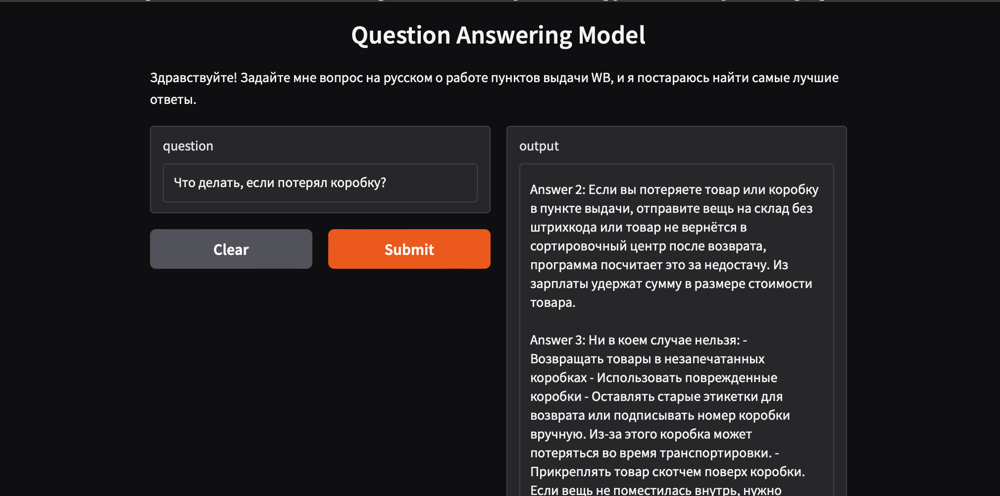

# WB_Knowledge_Base
This repository contains an approach to creating a knowledge base information retrieval system.

# Question Answering Model with Gradio Interface

A fine-tuned `SentenceTransformer` model retrieves relevant chunks from a knowledge base based on the input question and uses an optional cross-encoder for re-ranking. The interface is built using [Gradio](https://gradio.app/) to make it easy for users to ask questions and receive relevant answers.

# Features

- **Fine-tuned Model with Triplet Loss**: The model is trained using a `SentenceTransformer` with triplet loss, fine-tuned on custom terminology data.
- **Cross-Encoder Re-ranking**: The system uses a cross-encoder for enhanced answer re-ranking, improving the relevance of returned answers.
- **Gradio Interface**: An easy-to-use web interface built with Gradio, allowing users to ask questions and view the top-5 relevant answers.

# Preprocessing

Preprocessing proved to be a crucial step. Knowledge base and train data contained inconsistencies, repetitions, mistakes and misspellings. A cleaned `chunks.csv` was used to create new train data completed with hard negatives. Given the time constraints, this step unfortunately meant reducing the train data size.

# Fine-tuning

The fine-tuning portion was completed using triplet loss with SentenceTransformer to improve the model's understanding of the similarity between questions and relevant answers (chunks) from the knowledge base

You can refer to the code in `Fine_tuning_with_triplets.ipynb`.

**Prepare the Knowledge Base**:
   For the purposes of fine-tuning, creating a dataset with hard-negatives was an essential step. This code will only be compatible with train sets that contain a question, true chink and a hard-negative.

## Usage

The main code file (`WB_Triplets.ipynb`) contains the code to load the model, retrieve answers, and set up the Gradio interface. Here’s a breakdown of each component:

1. **Load Fine-Tuned Model**: Loads the `SentenceTransformer` model and precomputes embeddings for all chunks in the knowledge base.
2. **Chunk Retrieval with Cross-Encoder**: Uses cosine similarity for initial retrieval and an optional cross-encoder model for re-ranking.
3. **Gradio Interface**: Sets up a Gradio web application to interact with the model.

### Running the Model

During the following three days, the model is available at https://54bac118d6e06c6b04.gradio.live

## Gradio Interface

The Gradio interface accepts a question in Russian and displays the top-5 relevant chunks from the knowledge base as answers. It handles edge cases where:
- The question is empty or too short.
- The question is not in Russian.
- No relevant chunks are found.

Here’s a screenshot of the interface:

### Example Usage

- **Input**: "Что будет, если я отправлю не тот товар на склад? "
- **Output**:

Chunk 1:
Если вы не заметите подмену и отправите на склад не тот товар, из зарплаты вычтут сумму в размере стоимости вещи.

Chunk 2:
Удержание «Неотправленный возврат в коробке на склад». Если вы отправляли товар на склад, но он потерялся в пути, проверьте историю штрихкода и выберите в заявке склад или СЦ, где товар сканировали в последней раз. - Удержание «Подмена товара». Просмотрите историю штрихкода: там будет статус «Неправильное вложение на переупаковке» и название склада или СЦ, где обнаружили подмену — туда нужно будет отправить заявку. - Удержание «Не принятый товар на полку». Если в приходной коробке не оказалось одного из товаров, нужно найти в истории штрихкода последний склад или СЦ, где его сканировали, и отправить туда заявку.

Chunk 3:
При хранении товара не нужно: - Маркировать товар. Если на коробке будут надписи ручкой или маркером, покупатель может пожаловаться и вернуть товар как бракованный. Тогда из выплаты менеджера удержат сумму за брак. - Игнорировать верхние полки. Так вы лишайте склад дополнительного места для заказов. - Хаотично нумеровать места на складе. Ячейки и полки нужно маркировать в логичном порядке — так сможете быстрее находить и выдавать заказы. - Хранить заказы возле батарей. Товары могут испортиться из-за высокой температуры.  - Не соблюдать принцип «1 покупатель — 1 место». Кладите все покупки одного человека в отдельную ячейку, чтобы не тратить время на поиски.

Chunk 4:
Если вы потеряете товар или коробку в пункте выдачи, отправите вещь на склад без штрихкода или товар не вернётся в сортировочный центр после возврата, программа посчитает это за недостачу. Из зарплаты удержат сумму в размере стоимости товара.

Chunk 5:
Если вы не примете товар из приходной коробки, из зарплаты удержат сумму в размере стоимости вещи. Если товара в коробке не оказалось, за это тоже начислят долг.

### Metrics 

`Recall.ipynb` demonstrated the code that I used to verify the metrics. In this particular case, the focus is on recall@1, recall@#, and recall@5. I would like to highlite that the model improves its predictions by its second attempt at choosing the relevant chunk. The knowledge base itself has a lot similar chunks, thus making the metrics a bit less accurate. Sometimes the true chunk is not  semantically sifferent from the first or second proposed by the model. The following metrics are obtained through using an extremely small dataset with triplets (at about 150 entries). If expanded, the metrcis reach 0.8 for recall@1 (checked using large openly available knowledge bases and systetically created triplets).

Recall@1: 0.45
Recall@2: 0.56
Recall@3: 0.62
Recall@5: 0.68

### Baseline model

 `WB_Baseline.ipynb` contains the baseline model. To evaluate if using transformers and fine-tuning with heavy comtutational load indeed demonstated its benefits, first the data was fed to a simple tf-idf with cosine similarity model. The file includes metrics and examples.

 
